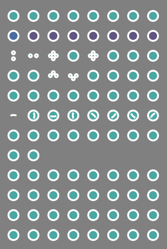

# tealcircs
minimally informative and minmally useful cursor theme for x11 (looks pretty though)

created using @charakterziffers [cursor-toolbox](https://github.com/charakterziffer/cursor-toolbox)

